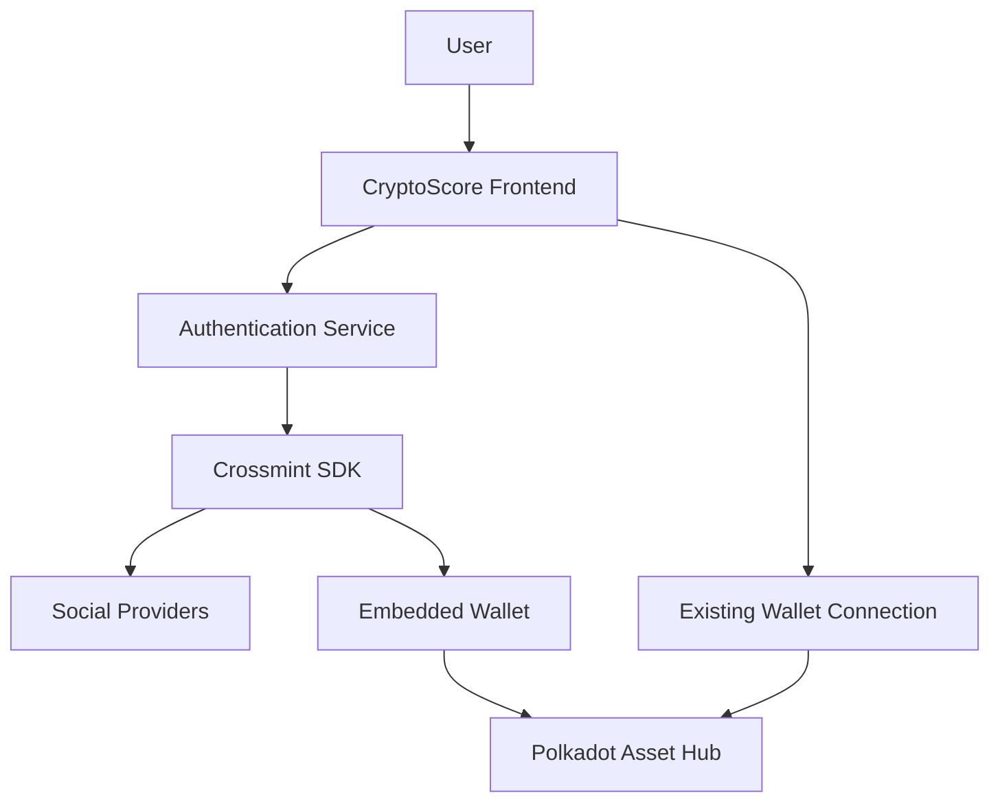

# Design Document

## Overview

The Crossmint social login integration will provide a seamless Web3 onboarding experience for CryptoScore users by abstracting wallet complexity behind familiar social authentication. This design leverages Crossmint's embedded wallet infrastructure to enable users to participate in prediction markets using Google, Twitter, Discord, or other social accounts without managing private keys.

## Architecture

### High-Level Architecture



### Component Integration

The integration will extend the existing authentication system without disrupting current wallet functionality:

1. **Authentication Layer**: New social login options alongside existing wallet connection
2. **Wallet Abstraction**: Crossmint embedded wallets for social users
3. **Transaction Management**: Unified interface for both wallet types
4. **Session Management**: Persistent authentication across browser sessions

## Components and Interfaces

### 1. Authentication Components

#### SocialLoginButton Component
```typescript
interface SocialLoginButtonProps {
  provider: 'google' | 'twitter' | 'discord' | 'apple'
  onSuccess: (user: CrossmintUser) => void
  onError: (error: AuthError) => void
  disabled?: boolean
}
```

#### AuthenticationModal Component
```typescript
interface AuthenticationModalProps {
  isOpen: boolean
  onClose: () => void
  showSocialOptions: boolean
  showWalletOptions: boolean
}
```

#### UserProfile Component
```typescript
interface UserProfileProps {
  user: CrossmintUser | WalletUser
  authMethod: 'social' | 'wallet'
  onLogout: () => void
  onSwitchAuth?: () => void
}
```

### 2. Service Layer

#### CrossmintService
```typescript
interface CrossmintService {
  initialize(config: CrossmintConfig): Promise<void>
  authenticate(provider: SocialProvider): Promise<CrossmintUser>
  getEmbeddedWallet(): Promise<EmbeddedWallet>
  signTransaction(transaction: Transaction): Promise<string>
  getBalance(): Promise<string>
  logout(): Promise<void>
}
```

#### AuthenticationService
```typescript
interface AuthenticationService {
  getCurrentUser(): User | null
  getAuthMethod(): 'social' | 'wallet' | null
  switchAuthMethod(method: 'social' | 'wallet'): Promise<void>
  isAuthenticated(): boolean
  getWalletAddress(): string | null
}
```

### 3. Context and State Management

#### AuthContext Enhancement
```typescript
interface AuthContextValue {
  user: User | null
  authMethod: 'social' | 'wallet' | null
  isLoading: boolean
  error: string | null
  
  // Social login methods
  loginWithSocial: (provider: SocialProvider) => Promise<void>
  
  // Existing wallet methods
  connectWallet: () => Promise<void>
  
  // Common methods
  logout: () => Promise<void>
  switchAuthMethod: (method: 'social' | 'wallet') => Promise<void>
}
```

## Data Models

### User Models

#### CrossmintUser
```typescript
interface CrossmintUser {
  id: string
  email?: string
  socialProvider: SocialProvider
  walletAddress: string
  embeddedWallet: EmbeddedWallet
  createdAt: Date
  lastLoginAt: Date
}
```

#### EmbeddedWallet
```typescript
interface EmbeddedWallet {
  address: string
  balance: string
  chainId: number
  isReady: boolean
  signTransaction: (tx: Transaction) => Promise<string>
  getBalance: () => Promise<string>
}
```

#### UnifiedUser (for both social and wallet users)
```typescript
interface UnifiedUser {
  id: string
  walletAddress: string
  authMethod: 'social' | 'wallet'
  profile?: {
    email?: string
    socialProvider?: SocialProvider
    avatar?: string
  }
  preferences: UserPreferences
}
```

### Configuration Models

#### CrossmintConfig
```typescript
interface CrossmintConfig {
  clientId: string
  environment: 'staging' | 'production'
  chain: {
    name: string
    chainId: number
    rpcUrl: string
  }
  socialProviders: SocialProvider[]
  ui: {
    theme: 'light' | 'dark' | 'auto'
    primaryColor: string
  }
}
```

## Error Handling

### Error Types

```typescript
enum AuthErrorType {
  SOCIAL_LOGIN_FAILED = 'SOCIAL_LOGIN_FAILED',
  WALLET_CREATION_FAILED = 'WALLET_CREATION_FAILED',
  TRANSACTION_FAILED = 'TRANSACTION_FAILED',
  SESSION_EXPIRED = 'SESSION_EXPIRED',
  NETWORK_ERROR = 'NETWORK_ERROR',
  PERMISSION_DENIED = 'PERMISSION_DENIED'
}

interface AuthError {
  type: AuthErrorType
  message: string
  details?: any
  retryable: boolean
}
```

### Error Handling Strategy

1. **Graceful Degradation**: Fall back to wallet connection if social login fails
2. **User-Friendly Messages**: Convert technical errors to understandable language
3. **Retry Mechanisms**: Automatic retry for transient failures
4. **Logging**: Comprehensive error logging for debugging
5. **Recovery Options**: Clear paths for users to recover from errors

## Testing Strategy

### Unit Testing

1. **Component Testing**: Test all authentication components with different states
2. **Service Testing**: Mock Crossmint SDK and test service layer logic
3. **Hook Testing**: Test custom hooks for authentication state management
4. **Utility Testing**: Test helper functions and formatters

### Integration Testing

1. **Authentication Flow**: End-to-end testing of social login process
2. **Wallet Operations**: Test embedded wallet transactions
3. **Session Management**: Test session persistence and expiration
4. **Error Scenarios**: Test various failure modes and recovery

### User Acceptance Testing

1. **Social Provider Testing**: Test with actual Google, Twitter, Discord accounts
2. **Cross-Browser Testing**: Ensure compatibility across browsers
3. **Mobile Testing**: Test responsive design and mobile authentication
4. **Performance Testing**: Measure authentication and transaction speeds

## Security Considerations

### Authentication Security

1. **OAuth 2.0 Compliance**: Follow OAuth 2.0 best practices for social login
2. **Token Management**: Secure storage and transmission of authentication tokens
3. **Session Security**: Implement secure session management with appropriate timeouts
4. **CSRF Protection**: Protect against cross-site request forgery attacks

### Wallet Security

1. **Key Management**: Crossmint handles private key security
2. **Transaction Signing**: Secure transaction signing within embedded wallet
3. **Permission Model**: Clear user consent for wallet operations
4. **Audit Trail**: Log all wallet operations for security monitoring

### Data Privacy

1. **Minimal Data Collection**: Only collect necessary user information
2. **Data Encryption**: Encrypt sensitive data in transit and at rest
3. **Privacy Controls**: Allow users to control data sharing preferences
4. **Compliance**: Ensure GDPR and other privacy regulation compliance

## Performance Optimization

### Loading Performance

1. **Lazy Loading**: Load Crossmint SDK only when needed
2. **Code Splitting**: Separate social login code from main bundle
3. **Caching**: Cache authentication state and user preferences
4. **Preloading**: Preload critical authentication resources

### Runtime Performance

1. **Efficient State Management**: Minimize unnecessary re-renders
2. **Debounced Operations**: Debounce frequent authentication checks
3. **Background Sync**: Sync authentication state in background
4. **Memory Management**: Proper cleanup of authentication resources

## Migration Strategy

### Existing Users

1. **Backward Compatibility**: Maintain existing wallet connection functionality
2. **Optional Migration**: Allow users to optionally link social accounts
3. **Data Preservation**: Preserve existing user data and preferences
4. **Gradual Rollout**: Phase rollout to monitor adoption and issues

### New Users

1. **Default Experience**: Present social login as primary option
2. **Progressive Disclosure**: Show wallet connection as advanced option
3. **Onboarding Flow**: Guide new users through social login benefits
4. **Fallback Options**: Always provide wallet connection alternative

## Monitoring and Analytics

### Key Metrics

1. **Authentication Success Rate**: Track successful vs failed logins
2. **Provider Adoption**: Monitor which social providers are most popular
3. **User Conversion**: Track conversion from authentication to market participation
4. **Session Duration**: Monitor user engagement after social login
5. **Error Rates**: Track and categorize authentication errors

### Monitoring Implementation

1. **Event Tracking**: Implement comprehensive event tracking
2. **Error Reporting**: Automatic error reporting with context
3. **Performance Monitoring**: Track authentication and transaction performance
4. **User Feedback**: Collect user feedback on authentication experience

## Deployment Strategy

### Environment Setup

1. **Development**: Crossmint staging environment with test social providers
2. **Staging**: Full integration testing with production-like setup
3. **Production**: Gradual rollout with feature flags

### Feature Flags

1. **Social Login Toggle**: Enable/disable social login functionality
2. **Provider Toggles**: Individual toggles for each social provider
3. **User Segment Flags**: Target specific user segments for testing
4. **Rollback Capability**: Quick rollback if issues arise

### Rollout Plan

1. **Phase 1**: Internal testing with development team
2. **Phase 2**: Beta testing with selected users
3. **Phase 3**: Gradual rollout to 10% of users
4. **Phase 4**: Full rollout based on success metrics