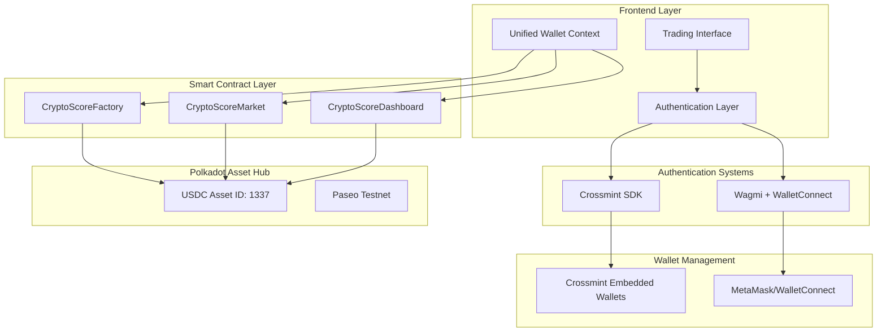
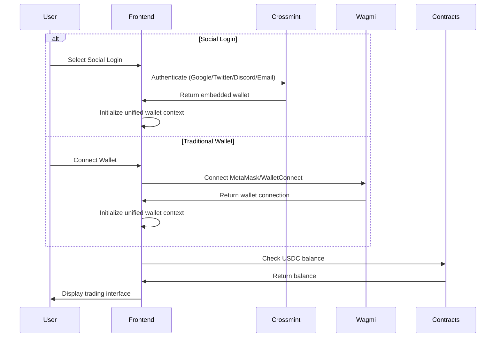

# Design Document

## Overview

The CryptoScore DEX transformation will convert the platform from a PAS-based prediction market to a USDC-based sports trading platform with dual authentication systems. The design focuses on seamless user onboarding through social login integration, unified wallet abstraction, and frictionless trading experiences similar to popular DEX platforms.

## Architecture

### High-Level Architecture



### Authentication Flow



## Components and Interfaces

### 1. Unified Wallet Context

**Purpose**: Abstract wallet differences between social login and traditional wallets

**Interface**:
```typescript
interface UnifiedWalletContext {
  // Wallet state
  address: `0x${string}` | undefined
  isConnected: boolean
  walletType: 'social' | 'external'
  
  // Authentication methods
  connectSocial: (provider: SocialProvider) => Promise<void>
  connectExternal: () => Promise<void>
  disconnect: () => Promise<void>
  
  // Transaction methods
  sendTransaction: (params: TransactionParams) => Promise<TransactionResult>
  signMessage: (message: string) => Promise<string>
  
  // Balance management
  getUSDCBalance: () => Promise<bigint>
  depositUSDC: (amount: bigint) => Promise<TransactionResult>
  withdrawUSDC: (amount: bigint, to: `0x${string}`) => Promise<TransactionResult>
}

type SocialProvider = 'google' | 'twitter' | 'discord' | 'email'
```

### 2. Crossmint Integration Layer

**Purpose**: Handle social authentication and embedded wallet management

**Components**:
- `CrossmintAuthProvider`: React context for Crossmint SDK
- `SocialLoginButton`: UI component for social login options
- `EmbeddedWalletManager`: Manages embedded wallet operations

**Key Features**:
- OAuth integration for Google, Twitter, Discord
- Email verification flow
- Embedded wallet creation and management
- Secure key management through Crossmint

### 3. USDC Asset Integration

**Purpose**: Handle USDC transactions on Polkadot Asset Hub

**Asset Configuration**:
```typescript
const USDC_ASSET = {
  id: 1337,
  decimals: 6,
  symbol: 'USDC',
  name: 'USD Coin'
}
```

**Transaction Types**:
- Direct asset transfers (no escrow)
- Balance queries
- Allowance management for pre-authorized trading

### 4. Pre-Authorization System

**Purpose**: Enable frictionless trading without transaction prompts

**Mechanism**:
- Users pre-approve spending limits for trading
- Smart contracts use approved allowances for trades
- Batch transactions for multiple operations
- Gasless transactions where possible

## Data Models

### User Profile
```typescript
interface UserProfile {
  id: string
  address: `0x${string}`
  walletType: 'social' | 'external'
  socialProvider?: SocialProvider
  createdAt: Date
  lastLoginAt: Date
  
  // Trading data
  usdcBalance: bigint
  totalVolume: bigint
  winRate: number
  activePositions: number
}
```

### Market Data (Updated for USDC)
```typescript
interface Market {
  address: `0x${string}`
  creator: `0x${string}`
  matchId: number
  entryFee: bigint // USDC amount (6 decimals)
  totalPool: bigint // USDC amount
  isPublic: boolean
  startTime: Date
  resolved: boolean
  winner?: Prediction
  
  // Prediction distribution
  homeCount: number
  awayCount: number
  drawCount: number
  
  // User participation
  userPrediction?: Prediction
  userReward?: bigint
}
```

### Transaction Record
```typescript
interface Transaction {
  hash: string
  type: 'deposit' | 'withdraw' | 'trade' | 'reward'
  amount: bigint // USDC amount
  status: 'pending' | 'confirmed' | 'failed'
  timestamp: Date
  marketAddress?: `0x${string}`
}
```

## Error Handling

### Authentication Errors
- **Social Login Failures**: Graceful fallback to traditional wallet connection
- **Network Errors**: Retry mechanisms with exponential backoff
- **Wallet Connection Issues**: Clear error messages and troubleshooting steps

### Transaction Errors
- **Insufficient Balance**: Pre-transaction balance checks with clear messaging
- **Network Congestion**: Transaction queuing and status updates
- **Failed Transactions**: Automatic retry for recoverable errors
- **Gas Estimation**: Dynamic gas price adjustment

### USDC Integration Errors
- **Asset Not Found**: Validation of USDC asset availability
- **Decimal Precision**: Proper handling of 6-decimal USDC amounts
- **Transfer Failures**: Comprehensive error handling for asset transfers

## Testing Strategy

### Unit Testing
- Unified wallet context functionality
- USDC amount calculations and formatting
- Social authentication flows
- Transaction signing and submission

### Integration Testing
- Crossmint SDK integration
- Wagmi + Crossmint compatibility
- Smart contract interactions with USDC
- End-to-end user flows

### User Acceptance Testing
- 2-minute onboarding flow
- Social login vs traditional wallet parity
- Trading experience smoothness
- Balance management accuracy

### Performance Testing
- Authentication response times
- Transaction execution speed
- UI responsiveness during wallet operations
- Memory usage with dual wallet systems

## Security Considerations

### Authentication Security
- OAuth token management and refresh
- Secure storage of authentication state
- Session timeout and re-authentication
- Cross-site request forgery protection

### Wallet Security
- Private key management through Crossmint
- Secure communication with embedded wallets
- Transaction signing verification
- Protection against wallet draining attacks

### Smart Contract Security
- USDC asset transfer validation
- Reentrancy protection for pre-authorized trades
- Access control for administrative functions
- Emergency pause mechanisms

## Implementation Phases

### Phase 1: Foundation (Weeks 1-2)
- Set up Crossmint SDK integration
- Create unified wallet context
- Update smart contracts for USDC
- Basic social authentication

### Phase 2: Core Features (Weeks 3-4)
- Implement deposit/withdrawal flows
- Pre-authorization system
- Trading interface updates
- Balance management

### Phase 3: Polish & Testing (Weeks 5-6)
- Comprehensive testing
- Performance optimization
- Error handling refinement
- Documentation completion

## Technical Specifications

### Smart Contract Updates

#### CryptoScoreFactory Changes
```solidity
// Add USDC asset integration
uint256 constant USDC_ASSET_ID = 1337;
uint8 constant USDC_DECIMALS = 6;

// Pre-authorization mapping
mapping(address => mapping(address => uint256)) public tradingAllowances;

function setTradingAllowance(address spender, uint256 amount) external;
function createMarketWithUSDC(uint256 matchId, uint256 entryFeeUSDC, bool isPublic, uint256 startTime) external;
```

#### CryptoScoreMarket Changes
```solidity
// Update entry fee to USDC
uint256 public entryFeeUSDC; // 6 decimal precision

// USDC transfer functions
function joinWithUSDC(Prediction prediction) external;
function withdrawRewardsUSDC() external;
function getUSDCBalance(address user) external view returns (uint256);
```

### Frontend Integration Points

#### Crossmint Configuration
```typescript
const crossmintConfig = {
  clientApiKey: process.env.VITE_CROSSMINT_API_KEY,
  environment: 'staging', // or 'production'
  chain: 'polkadot-asset-hub',
  walletConfig: {
    type: 'custodial',
    createOnLogin: 'all-users'
  }
}
```

#### Wagmi + Crossmint Bridge
```typescript
// Custom connector for Crossmint integration
const crossmintConnector = createConnector((config) => ({
  id: 'crossmint',
  name: 'Crossmint',
  type: 'social',
  // Implementation details
}))
```

## Migration Strategy

### User Migration
- **No PAS Migration**: Fresh start for all users
- **New Registration**: All users must re-register
- **Data Cleanup**: Clear existing localStorage and user data

### Contract Deployment
- Deploy new USDC-compatible contracts
- Update frontend configuration
- Retire old PAS-based contracts

### Testing Approach
- Parallel testing environment
- Gradual rollout to beta users
- Comprehensive monitoring and rollback plan

## Success Metrics

### Performance Metrics
- Authentication time: < 30 seconds
- Wallet creation time: < 30 seconds
- Trading interface load: < 60 seconds
- Total onboarding: < 120 seconds

### User Experience Metrics
- Social login success rate: > 95%
- Transaction approval bypass: 100% for pre-authorized trades
- Balance accuracy: 100%
- Cross-wallet feature parity: 100%

### Technical Metrics
- USDC decimal precision: 100% accuracy
- Transaction success rate: > 98%
- Error recovery rate: > 90%
- Security incident rate: 0%