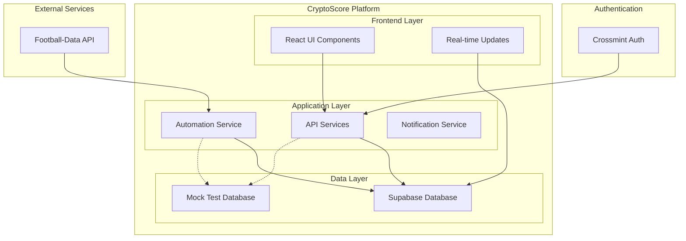
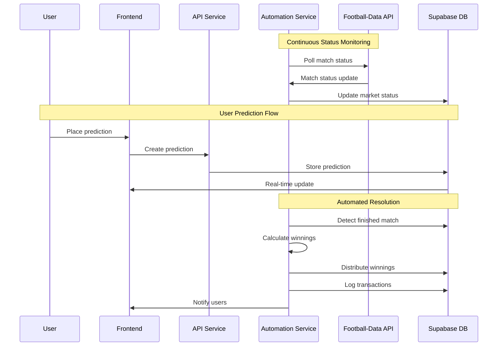

# Enhanced Prediction System Design Document

## Overview

The Enhanced Prediction System transforms CryptoScore into a sophisticated sports prediction platform with automated operations, multiple predictions per user, and seamless integration with football-data API. This design builds upon the existing web2-migration foundation and introduces advanced features for automated market resolution, comprehensive transaction logging, and improved user experience.

The system eliminates manual intervention by automating market resolution and winnings distribution while providing users with the flexibility to place multiple predictions per market. Integration with football-data API ensures real-time synchronization of market statuses with actual sports events.

## Architecture

### High-Level Architecture



### Data Flow Architecture



## Components and Interfaces

### Database Schema Enhancements

#### Updated Markets Table
```sql
CREATE TABLE markets (
    id UUID PRIMARY KEY DEFAULT uuid_generate_v4(),
    creator_id UUID NOT NULL REFERENCES users(id) ON DELETE CASCADE,
    match_id INTEGER NOT NULL, -- Football-Data API match ID
    home_team_id INTEGER NOT NULL, -- Football-Data API team ID
    home_team_name TEXT NOT NULL,
    away_team_id INTEGER NOT NULL, -- Football-Data API team ID  
    away_team_name TEXT NOT NULL,
    title TEXT NOT NULL,
    description TEXT NOT NULL,
    entry_fee DECIMAL(20, 8) NOT NULL CHECK (entry_fee >= 0),
    end_time TIMESTAMP WITH TIME ZONE NOT NULL,
    status match_status DEFAULT 'SCHEDULED', -- Updated enum
    resolution_outcome TEXT,
    total_pool DECIMAL(20, 8) DEFAULT 0 CHECK (total_pool >= 0),
    platform_fee_percentage DECIMAL(5, 4) DEFAULT 0.03,
    creator_reward_percentage DECIMAL(5, 4) DEFAULT 0.02,
    created_at TIMESTAMP WITH TIME ZONE DEFAULT NOW(),
    updated_at TIMESTAMP WITH TIME ZONE DEFAULT NOW(),
    
    UNIQUE(match_id) -- One market per match
);
```

#### Updated Match Status Enum
```sql
CREATE TYPE match_status AS ENUM (
    'SCHEDULED',    -- Match is scheduled but not started
    'LIVE',         -- Match is currently in progress
    'IN_PLAY',      -- Alternative live status
    'PAUSED',       -- Match temporarily paused
    'FINISHED',     -- Match completed normally
    'POSTPONED',    -- Match postponed to later date
    'CANCELLED',    -- Match cancelled
    'SUSPENDED'     -- Match suspended indefinitely
);
```

#### Updated Participants Table
```sql
CREATE TABLE participants (
    id UUID PRIMARY KEY DEFAULT uuid_generate_v4(),
    market_id UUID NOT NULL REFERENCES markets(id) ON DELETE CASCADE,
    user_id UUID NOT NULL REFERENCES users(id) ON DELETE CASCADE,
    prediction TEXT NOT NULL, -- 'HOME_WIN', 'DRAW', 'AWAY_WIN'
    entry_amount DECIMAL(20, 8) NOT NULL CHECK (entry_amount >= 0),
    potential_winnings DECIMAL(20, 8) NOT NULL CHECK (potential_winnings >= 0),
    actual_winnings DECIMAL(20, 8) CHECK (actual_winnings >= 0),
    joined_at TIMESTAMP WITH TIME ZONE DEFAULT NOW(),
    
    -- Allow multiple predictions per user, but only one per outcome
    UNIQUE(market_id, user_id, prediction)
);
```

#### Enhanced Transaction Types
```sql
CREATE TYPE transaction_type AS ENUM (
    'market_entry',
    'winnings',
    'platform_fee',
    'creator_reward',
    'automated_transfer'
);
```

### API Service Interfaces

#### Market Service Interface
```typescript
interface MarketService {
  // Enhanced market creation with match data
  createMarket(data: {
    matchId: number;
    homeTeamId: number;
    homeTeamName: string;
    awayTeamId: number;
    awayTeamName: string;
    title: string;
    description: string;
    entryFee: number;
    endTime: Date;
  }): Promise<Market>;
  
  // Multiple predictions support
  createPrediction(data: {
    marketId: string;
    userId: string;
    prediction: 'HOME_WIN' | 'DRAW' | 'AWAY_WIN';
    entryAmount: number;
  }): Promise<Participant>;
  
  // Get user's predictions for a market
  getUserPredictions(marketId: string, userId: string): Promise<Participant[]>;
  
  // Validate prediction limits
  validatePredictionLimit(marketId: string, userId: string, prediction: string): Promise<boolean>;
}
```

#### Automation Service Interface
```typescript
interface AutomationService {
  // Status synchronization
  syncMatchStatuses(): Promise<void>;
  updateMarketStatus(matchId: number, status: MatchStatus): Promise<void>;
  
  // Automated resolution
  resolveFinishedMarkets(): Promise<void>;
  calculateWinnings(marketId: string): Promise<WinningsCalculation>;
  distributeWinnings(marketId: string): Promise<TransactionResult[]>;
  
  // Creator rewards
  calculateCreatorReward(marketId: string): Promise<number>;
  distributeCreatorReward(marketId: string): Promise<TransactionResult>;
}
```

#### Football-Data API Integration
```typescript
interface FootballDataService {
  // Match data retrieval
  getMatch(matchId: number): Promise<MatchData>;
  getMatchesByDate(date: Date): Promise<MatchData[]>;
  
  // Status monitoring
  getMatchStatus(matchId: number): Promise<MatchStatus>;
  subscribeToStatusUpdates(matchIds: number[]): Promise<void>;
}

interface MatchData {
  id: number;
  status: MatchStatus;
  homeTeam: {
    id: number;
    name: string;
  };
  awayTeam: {
    id: number;
    name: string;
  };
  score: {
    fullTime: {
      homeTeam: number;
      awayTeam: number;
    };
  };
  utcDate: string;
}
```

## Data Models

### Enhanced Market Model
```typescript
interface Market {
  id: string;
  creatorId: string;
  matchId: number;
  homeTeamId: number;
  homeTeamName: string;
  awayTeamId: number;
  awayTeamName: string;
  title: string;
  description: string;
  entryFee: number;
  endTime: Date;
  status: MatchStatus;
  resolutionOutcome?: 'HOME_WIN' | 'DRAW' | 'AWAY_WIN';
  totalPool: number;
  platformFeePercentage: number;
  creatorRewardPercentage: number;
  createdAt: Date;
  updatedAt: Date;
}
```

### Multiple Predictions Model
```typescript
interface Participant {
  id: string;
  marketId: string;
  userId: string;
  prediction: 'HOME_WIN' | 'DRAW' | 'AWAY_WIN';
  entryAmount: number;
  potentialWinnings: number;
  actualWinnings?: number;
  joinedAt: Date;
}

interface UserMarketPredictions {
  marketId: string;
  userId: string;
  predictions: Participant[];
  totalStaked: number;
  maxPossibleWinnings: number;
}
```

### Transaction Logging Model
```typescript
interface Transaction {
  id: string;
  userId: string;
  marketId?: string;
  type: TransactionType;
  amount: number;
  description: string;
  status: 'PENDING' | 'COMPLETED' | 'FAILED';
  metadata: {
    predictionId?: string;
    matchId?: number;
    automatedTransfer?: boolean;
  };
  createdAt: Date;
}
```

## Correctness Properties

*A property is a characteristic or behavior that should hold true across all valid executions of a system-essentially, a formal statement about what the system should do. Properties serve as the bridge between human-readable specifications and machine-verifiable correctness guarantees.*

Before writing the correctness properties, I need to analyze the acceptance criteria for testability:

<function_calls>
<invoke name="prework">
<parameter name="featureName">enhanced-prediction-system

### Property Reflection

After reviewing all testable properties from the prework analysis, I've identified several areas where properties can be consolidated to eliminate redundancy:

**Redundant Properties Identified:**
- Properties 1.1 and 2.1 both test match_id storage during market creation - can be combined
- Properties 2.2 and 2.3 both test team data storage - can be combined into one comprehensive property
- Properties 4.2 and 4.3 both test automated operations - can be combined
- Properties 5.1 and 5.3 both test automated distribution calculations - can be combined
- Properties 6.2 and 6.3 both test transaction record completeness - can be combined

**Consolidated Properties:**
The following properties provide unique validation value and will be implemented:

Property 1: Market creation stores complete match data
*For any* market creation request with match data, the system should store match_id, home_team_id, home_team_name, away_team_id, and away_team_name in the database
**Validates: Requirements 1.1, 2.1, 2.2, 2.3**

Property 2: Status synchronization maintains consistency
*For any* match status update from football-data API, the corresponding market status should be updated to match, maintaining data consistency between external API and internal database
**Validates: Requirements 1.2, 1.4, 1.5**

Property 3: Market display includes team information
*For any* market display request, the rendered output should contain team names and match information retrieved from the database
**Validates: Requirements 2.4**

Property 4: Multiple predictions per user are enforced
*For any* user and market combination, the system should allow up to 3 predictions (one per outcome) and prevent duplicate predictions for the same outcome
**Validates: Requirements 3.1, 3.2**

Property 5: Multiple predictions are tracked independently
*For any* user placing multiple predictions, each prediction should be stored as a separate record with individual entry amounts
**Validates: Requirements 3.4**

Property 6: Winnings calculation considers only winning predictions
*For any* market resolution, only predictions matching the winning outcome should receive winnings calculations
**Validates: Requirements 3.5**

Property 7: Automated resolution triggers on match completion
*For any* finished match, the system should automatically resolve the corresponding market and update its status
**Validates: Requirements 4.1, 4.4**

Property 8: Automated winnings and rewards distribution
*For any* market resolution, the system should automatically calculate and transfer winnings to winners and creator rewards to market creators
**Validates: Requirements 4.2, 4.3, 5.1, 5.3**

Property 9: Transaction logging completeness
*For any* transfer operation, the system should create detailed transaction records including market information, prediction details, and transfer status
**Validates: Requirements 5.4, 6.2, 6.3**

Property 10: Platform fee transaction separation
*For any* market resolution with platform fees, fee deductions should create separate transaction records for transparency
**Validates: Requirements 6.4**

Property 11: Transaction atomicity in resolution
*For any* market resolution, all transfers must complete successfully before marking resolution as complete
**Validates: Requirements 5.6**

Property 12: Test data isolation
*For any* test execution, test data should be stored in isolated environments and cleaned up completely after test completion
**Validates: Requirements 7.2, 7.3, 7.5**

Property 13: Multiple prediction UI support
*For any* market interface, the system should display options for multiple predictions and handle their creation and retrieval correctly
**Validates: Requirements 8.1, 8.2**

Property 14: Portfolio aggregation with multiple predictions
*For any* portfolio calculation, the system should correctly aggregate all user predictions and broadcast real-time updates for all predictions
**Validates: Requirements 8.4, 8.5**

Property 15: Full automation of market lifecycle
*For any* market operation, the system should handle all lifecycle events automatically without requiring manual intervention
**Validates: Requirements 9.5**

Property 16: Safe database migration
*For any* database migration, existing data should be safely transformed to the new schema without data loss
**Validates: Requirements 10.4**

## Error Handling

### Football-Data API Integration Errors
- **API Unavailability**: Implement retry logic with exponential backoff
- **Rate Limiting**: Queue status updates and respect API rate limits
- **Invalid Match Data**: Validate match data before creating markets
- **Status Mapping Errors**: Maintain fallback status mappings for unknown values

### Multiple Predictions Validation
- **Prediction Limit Exceeded**: Return clear error messages when users attempt more than 3 predictions
- **Duplicate Outcome Prevention**: Validate against existing predictions before allowing new ones
- **Invalid Prediction Values**: Ensure predictions match allowed outcomes (HOME_WIN, DRAW, AWAY_WIN)

### Automated Resolution Errors
- **Calculation Failures**: Implement transaction rollback for failed winnings calculations
- **Transfer Failures**: Retry failed transfers with exponential backoff
- **Partial Resolution**: Handle cases where some transfers succeed and others fail
- **Creator Reward Failures**: Separate creator reward processing from user winnings

### Database and Testing Errors
- **Mock Database Failures**: Provide clear error messages for test setup issues
- **Migration Failures**: Implement rollback mechanisms for failed schema migrations
- **Data Consistency**: Validate data integrity after automated operations

## Testing Strategy

### Dual Testing Approach

The system will implement both unit testing and property-based testing to ensure comprehensive coverage:

**Unit Testing Focus:**
- Specific examples of market creation with match data
- Edge cases for multiple prediction validation
- Integration points between automation service and database
- Mock database setup and teardown procedures
- Error handling scenarios for API failures

**Property-Based Testing Focus:**
- Universal properties that should hold across all inputs using **fast-check** library
- Each property-based test will run a minimum of 100 iterations
- Properties will be tagged with comments referencing design document properties

**Property-Based Testing Requirements:**
- Use **fast-check** as the property-based testing library for TypeScript/JavaScript
- Configure each test to run minimum 100 iterations for thorough random testing
- Tag each test with format: **Feature: enhanced-prediction-system, Property {number}: {property_text}**
- Each correctness property must be implemented by a single property-based test

**Mock Database Testing:**
- All tests (existing and future) must use mock database implementations
- No test should connect to production Supabase instances
- Existing tests must be migrated to use mock databases
- Test data must be isolated and cleaned up after each test
- Integration tests must simulate database operations without external dependencies

**Test Organization:**
- Unit tests for specific functionality and edge cases
- Property tests for universal correctness properties
- Integration tests using mock databases for end-to-end workflows
- Performance tests for automated resolution and distribution systems

The testing strategy ensures that both concrete examples (unit tests) and general correctness (property tests) are verified, providing comprehensive coverage of the enhanced prediction system functionality.