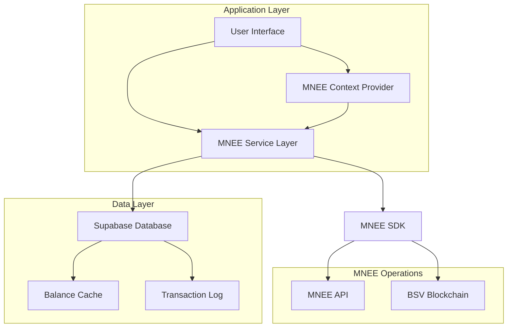

# MNEE Integration Design Document

## Overview

This design document outlines the architecture and implementation approach for integrating MNEE tokens as the primary value exchange mechanism in CryptoScore, replacing the current SOL-based system. The integration will leverage the MNEE TypeScript SDK to handle token operations while maintaining the existing user experience and functionality patterns.

The design focuses on seamless token operations, proper unit conversion between atomic units and MNEE tokens, comprehensive error handling, and real-time balance updates. The integration will remove the multi-currency exchange rate system and simplify the application to use MNEE as the single currency.

## Architecture

### High-Level Architecture



### Service Layer Architecture

The MNEE integration will follow a layered architecture:

1. **Presentation Layer**: React components and hooks for user interaction
2. **Context Layer**: MNEE context provider for state management and formatting
3. **Service Layer**: MNEE service for business logic and SDK operations
4. **SDK Layer**: MNEE TypeScript SDK for blockchain interactions
5. **Data Layer**: Supabase database for caching and transaction logging

## Components and Interfaces

### MNEE Service Interface

```typescript
interface MneeServiceInterface {
  // Configuration
  initialize(config: MneeConfig): Promise<void>
  getConfig(): Promise<MneeConfiguration>
  
  // Balance Operations
  getBalance(address: string): Promise<MneeBalance>
  getBalances(addresses: string[]): Promise<MneeBalance[]>
  subscribeToBalance(address: string, callback: BalanceCallback): () => void
  
  // Transfer Operations
  transfer(recipients: TransferRecipient[], privateKey: string): Promise<TransferResult>
  validateTransfer(recipients: TransferRecipient[], privateKey: string): Promise<boolean>
  
  // Transaction Management
  getTransactionStatus(ticketId: string): Promise<TransactionStatus>
  getTransactionHistory(address: string, options?: HistoryOptions): Promise<TransactionHistory[]>
  
  // Unit Conversion
  toAtomicUnits(mneeAmount: number): number
  fromAtomicUnits(atomicAmount: number): number
  formatMneeAmount(atomicAmount: number, options?: FormatOptions): string
}
```

### MNEE Context Interface

```typescript
interface MneeContextType {
  // Balance State
  balance: number | null
  isLoadingBalance: boolean
  balanceError: string | null
  
  // Configuration
  isInitialized: boolean
  config: MneeConfiguration | null
  
  // Operations
  refreshBalance(): Promise<void>
  transfer(recipients: TransferRecipient[]): Promise<TransferResult>
  
  // Formatting
  formatAmount(atomicAmount: number, options?: FormatOptions): string
  parseAmount(mneeAmount: string): number
  
  // Error Handling
  clearErrors(): void
}
```

### Data Models

```typescript
interface MneeBalance {
  address: string
  amount: number // atomic units
  decimalAmount: number // MNEE tokens
  lastUpdated: number
}

interface TransferRecipient {
  address: string
  amount: number // MNEE tokens
}

interface TransferResult {
  ticketId?: string
  transactionId?: string
  status: 'pending' | 'success' | 'failed'
  error?: string
}

interface MneeConfiguration {
  environment: 'production' | 'sandbox'
  apiKey: string
  feeAddress: string
  fees: FeeTier[]
}

interface FeeTier {
  min: number // atomic units
  max: number // atomic units
  fee: number // atomic units
}
```

## Data Models

### Database Schema Updates

The existing Supabase schema will be updated to handle MNEE amounts:

```sql
-- Update markets table to use MNEE atomic units
ALTER TABLE markets 
ALTER COLUMN entry_fee TYPE BIGINT; -- Store as atomic units

-- Update participants table
ALTER TABLE participants 
ALTER COLUMN entry_amount TYPE BIGINT; -- Store as atomic units

-- Update transactions table
ALTER TABLE transactions 
ALTER COLUMN amount TYPE BIGINT, -- Store as atomic units
ADD COLUMN mnee_transaction_id TEXT, -- MNEE blockchain transaction ID
ADD COLUMN ticket_id TEXT; -- MNEE SDK ticket ID

-- Add MNEE balance cache table
CREATE TABLE mnee_balances (
  id UUID PRIMARY KEY DEFAULT gen_random_uuid(),
  user_id UUID REFERENCES auth.users(id),
  address TEXT NOT NULL,
  balance_atomic BIGINT NOT NULL DEFAULT 0,
  balance_decimal DECIMAL(20,5) NOT NULL DEFAULT 0,
  last_updated TIMESTAMP WITH TIME ZONE DEFAULT NOW(),
  created_at TIMESTAMP WITH TIME ZONE DEFAULT NOW(),
  UNIQUE(user_id, address)
);

-- Add indexes for performance
CREATE INDEX idx_mnee_balances_user_id ON mnee_balances(user_id);
CREATE INDEX idx_mnee_balances_address ON mnee_balances(address);
CREATE INDEX idx_transactions_mnee_tx_id ON transactions(mnee_transaction_id);
```

### Unit Conversion Strategy

All amounts will be stored in atomic units (1 MNEE = 100,000 atomic units) for precision:

- **Database Storage**: Always atomic units (BIGINT)
- **SDK Operations**: Atomic units for calculations, MNEE tokens for user input
- **User Interface**: Always display MNEE tokens with 5 decimal places
- **API Responses**: Include both atomic and decimal amounts

## Correctness Properties

*A property is a characteristic or behavior that should hold true across all valid executions of a system-essentially, a formal statement about what the system should do. Properties serve as the bridge between human-readable specifications and machine-verifiable correctness guarantees.*

### Property Reflection

After analyzing all acceptance criteria, several properties can be consolidated to eliminate redundancy:

**Consolidation Analysis:**
- Properties about MNEE display formatting (1.1, 1.5, 4.3, 9.3) can be combined into a comprehensive display property
- Properties about atomic unit storage (5.5, 7.1, 11.4) can be consolidated into a single storage consistency property  
- Properties about unit conversion (7.2, 7.3, 7.5) can be combined into a comprehensive conversion property
- Properties about automatic transfers (6.1, 6.2, 6.3) can be consolidated into a single transfer automation property
- Properties about balance updates (3.2, 12.1, 12.2) can be combined into a real-time balance property

**Final Property Set:**
After consolidation, we have 15 unique properties that provide comprehensive validation coverage without redundancy.

### Correctness Properties

Property 1: MNEE display consistency
*For any* amount displayed in the user interface, the system should show MNEE token values with consistent formatting and symbols instead of SOL
**Validates: Requirements 1.1, 1.5, 4.3, 9.3**

Property 2: Balance query integration
*For any* user balance request, the system should use MNEE SDK balance methods and return MNEE token amounts
**Validates: Requirements 2.2, 3.1, 8.2**

Property 3: Transfer operation integration
*For any* token transfer requirement, the system should use MNEE SDK transfer methods for all winnings and fee distributions
**Validates: Requirements 2.3, 6.1, 6.2, 6.3**

Property 4: Transaction validation integration
*For any* transaction that requires validation, the system should use MNEE SDK validation methods
**Validates: Requirements 2.4**

Property 5: Market operation MNEE integration
*For any* market operation (creation, joining, resolution), the system should handle entry fees, balance validation, and winnings distribution using MNEE tokens
**Validates: Requirements 5.1, 5.2, 5.3**

Property 6: Fee calculation consistency
*For any* platform fee calculation, the system should compute fees as percentages of MNEE amounts
**Validates: Requirements 1.4, 5.4**

Property 7: Atomic unit storage consistency
*For any* amount stored in the database, the system should use MNEE atomic units for precision
**Validates: Requirements 5.5, 7.1, 11.4**

Property 8: Unit conversion accuracy
*For any* amount conversion between atomic units and MNEE tokens, the system should maintain precision and consistent decimal formatting
**Validates: Requirements 7.2, 7.3, 7.5**

Property 9: EVM wallet integration
*For any* MNEE operation requiring a wallet address, the system should use the user's EVM wallet address from Crossmint authentication
**Validates: Requirements 8.1, 8.2, 8.4, 8.5**

Property 10: Database consistency after transfers
*For any* completed transfer operation, the system should update database records to reflect new balances accurately
**Validates: Requirements 6.5**

Property 11: Real-time balance updates
*For any* MNEE transaction or market operation, the system should update affected user balances in real-time
**Validates: Requirements 3.2, 12.1, 12.2, 12.4**

Property 12: Balance subscription processing
*For any* active balance subscription, the system should receive and process balance change notifications correctly
**Validates: Requirements 12.3**

Property 13: Error handling consistency
*For any* MNEE SDK operation failure, the system should display user-friendly error messages and handle failures gracefully
**Validates: Requirements 10.1, 10.3**

Property 14: Data validation ranges
*For any* MNEE amount validation, the system should ensure amounts are within valid ranges and properly formatted
**Validates: Requirements 11.5**

Property 15: Portfolio calculation accuracy
*For any* portfolio display, the system should show MNEE-based profit/loss calculations and transaction history with proper formatting
**Validates: Requirements 3.3, 3.4**

## Error Handling

### Error Categories and Strategies

#### SDK Operation Errors
- **Balance Query Failures**: Implement retry logic with exponential backoff, fallback to cached balances
- **Transfer Failures**: Detailed error logging, user notification, transaction rollback if needed
- **Validation Errors**: Clear user feedback, prevent invalid operations from proceeding
- **Network Timeouts**: Graceful degradation, offline mode indicators, retry mechanisms

#### Configuration Errors
- **Invalid API Keys**: Clear error messages, environment validation on startup
- **Environment Mismatches**: Prevent production/sandbox mixing, configuration validation
- **Missing Configuration**: Fail-fast with descriptive error messages

#### Data Consistency Errors
- **Unit Conversion Errors**: Validation at boundaries, precision checks
- **Balance Mismatches**: Reconciliation processes, audit logging
- **Database Constraint Violations**: Transaction rollback, data integrity checks

### Error Recovery Patterns

```typescript
// Retry pattern for balance queries
async function getBalanceWithRetry(address: string, maxRetries = 3): Promise<MneeBalance> {
  for (let attempt = 1; attempt <= maxRetries; attempt++) {
    try {
      return await mneeService.getBalance(address)
    } catch (error) {
      if (attempt === maxRetries) {
        // Final attempt failed, try cached balance
        const cached = await getCachedBalance(address)
        if (cached) return cached
        throw error
      }
      
      // Wait before retry with exponential backoff
      await delay(Math.pow(2, attempt) * 1000)
    }
  }
}

// Circuit breaker pattern for SDK operations
class MneeCircuitBreaker {
  private failures = 0
  private lastFailureTime = 0
  private readonly threshold = 5
  private readonly timeout = 60000 // 1 minute
  
  async execute<T>(operation: () => Promise<T>): Promise<T> {
    if (this.isOpen()) {
      throw new Error('Circuit breaker is open')
    }
    
    try {
      const result = await operation()
      this.onSuccess()
      return result
    } catch (error) {
      this.onFailure()
      throw error
    }
  }
  
  private isOpen(): boolean {
    return this.failures >= this.threshold && 
           (Date.now() - this.lastFailureTime) < this.timeout
  }
}
```

## Testing Strategy

### Dual Testing Approach

The MNEE integration will use both unit testing and property-based testing to ensure comprehensive coverage:

**Unit Testing Focus:**
- SDK configuration and initialization
- Error handling scenarios and edge cases
- Component integration points
- User interface interactions
- Database operations and migrations

**Property-Based Testing Focus:**
- Universal properties that should hold across all inputs using **fast-check** library
- Each property-based test will run a minimum of 100 iterations
- Tests will be tagged with comments referencing design document properties
- Format: `**Feature: mnee-integration, Property {number}: {property_text}**`

### Property-Based Testing Configuration

The testing strategy will use **fast-check** as the property-based testing library for TypeScript. Each correctness property will be implemented as a single property-based test with the following configuration:

```typescript
// Example property test configuration
import fc from 'fast-check'

describe('MNEE Integration Properties', () => {
  it('should maintain MNEE display consistency', () => {
    /**
     * Feature: mnee-integration, Property 1: MNEE display consistency
     * For any amount displayed in the user interface, the system should show MNEE token values with consistent formatting and symbols instead of SOL
     */
    fc.assert(
      fc.property(
        fc.integer({ min: 0, max: 1000000000 }), // atomic units
        (atomicAmount) => {
          const formatted = formatMneeAmount(atomicAmount)
          return formatted.includes('MNEE') && !formatted.includes('◎') && !formatted.includes('SOL')
        }
      ),
      { numRuns: 100 }
    )
  })
})
```

### Test Data Generation Strategy

Property-based tests will use smart generators that constrain inputs to valid ranges:

- **Amount Generators**: Generate valid MNEE amounts in both atomic units and decimal format
- **Address Generators**: Generate valid EVM wallet addresses
- **Market Generators**: Generate realistic market scenarios with participants and outcomes
- **Transaction Generators**: Generate valid transfer scenarios with multiple recipients

### Integration Testing

Integration tests will cover:
- End-to-end market creation and participation flows
- Real-time balance update scenarios
- Error recovery and retry mechanisms
- Database consistency after operations
- SDK integration with actual MNEE sandbox environment

## Implementation Phases

### Phase 1: Core SDK Integration
1. Install and configure MNEE SDK
2. Create MNEE service layer
3. Implement basic balance queries
4. Set up unit conversion utilities
5. Create error handling framework

### Phase 2: Context and State Management
1. Refactor CurrencyContext to MneeContext
2. Remove exchange rate service and related code
3. Update all currency-related hooks
4. Implement real-time balance subscriptions
5. Add balance caching mechanisms

### Phase 3: Market Operations Integration
1. Update market creation to use MNEE
2. Modify market joining logic
3. Implement MNEE-based winnings calculation
4. Update fee collection system
5. Add automatic transfer functionality

### Phase 4: UI and UX Updates
1. Update all currency displays to MNEE
2. Remove currency selector components
3. Update formatting throughout application
4. Add MNEE-specific loading states
5. Implement error message improvements

### Phase 5: Database and Migration
1. Update database schema for atomic units
2. Create migration scripts for existing data
3. Implement balance caching tables
4. Add transaction logging enhancements
5. Update all database queries

### Phase 6: Testing and Validation
1. Implement property-based tests
2. Add comprehensive unit tests
3. Create integration test scenarios
4. Perform end-to-end testing
5. Validate error handling and recovery

## Performance Considerations

### Balance Query Optimization
- Implement intelligent caching with TTL
- Use batch operations for multiple addresses
- Minimize API calls through strategic caching
- Implement background refresh for active users

### Real-time Updates
- Use WebSocket connections for balance subscriptions
- Implement efficient state updates to prevent unnecessary re-renders
- Batch balance updates for multiple users
- Use optimistic updates with rollback capability

### Database Performance
- Index atomic unit columns for fast queries
- Use appropriate data types for large numbers
- Implement connection pooling for high concurrency
- Cache frequently accessed balance data

### SDK Usage Optimization
- Reuse SDK instances across operations
- Implement connection pooling for API requests
- Use batch operations when available
- Implement request deduplication for identical operations

## Security Considerations

### Private Key Management
- Never store private keys in application state
- Use secure key derivation from user authentication
- Implement proper key rotation mechanisms
- Audit all private key usage points

### Transaction Security
- Validate all transactions before broadcasting
- Implement transaction signing verification
- Use secure random number generation
- Implement replay attack prevention

### API Security
- Secure API key storage and rotation
- Implement rate limiting and throttling
- Use HTTPS for all API communications
- Validate all API responses

### Data Security
- Encrypt sensitive data at rest
- Use secure database connections
- Implement proper access controls
- Audit all data access patterns

## Monitoring and Observability

### Metrics Collection
- Track balance query success/failure rates
- Monitor transfer operation latencies
- Measure API response times
- Track error rates by category

### Logging Strategy
- Log all MNEE operations with correlation IDs
- Implement structured logging for analysis
- Track user actions and system responses
- Monitor balance consistency checks

### Alerting
- Alert on high error rates
- Monitor API quota usage
- Track unusual balance changes
- Alert on failed transfers

### Performance Monitoring
- Track component render times
- Monitor database query performance
- Measure real-time update latency
- Track user experience metrics